# Monopole Antenna Simulation
## Supervised By :
- ***Dr. Ahmed Hamdy***
- ***Eng. Abdelrahman Hassan***

## By : 
- ***Osama Hatem***
- ***Osama Ahmed***
- ***belal Suliman***
- ***ziad saleh***
- ***shrouk osama***
---

## Table of Contents

- [1. Introduction and Background](#1-introduction-and-background)  
  - [1.1 History of Monopole Antenna](#history-of-monopole-antenna)  
  - [1.2 What is a Monopole Antenna?](#what-is-a-monopole-antenna)  
  - [1.3 Operating Principles](#operating-principles)  
  - [1.4 Characteristics](#characteristics)  
  - [1.5 Common Applications](#common-applications)  
  - [1.6 Types of Monopole Antennas](#types-of-monopole-antennas)  
  - [1.7 Design Considerations and Optimization](#design-considerations-and-optimization)  
  - [1.8 Advantages](#advantages)  
  - [1.9 Disadvantages](#disadvantages)  

- [2. Design Methodology](#2-design-methodology)  
  - [2.1 Antenna Type](#21-antenna-type)  
  - [2.2 Operating Frequency and Wavelength Calculation](#22-operating-frequency-and-wavelength-calculation)  
  - [2.3 Ground Plane Design](#23-ground-plane-design)  
  - [2.4 Monopole Geometry](#24-monopole-geometry)  
  - [2.5 Feeding Mechanism](#25-feeding-mechanism)  
  - [2.6 Simulation Settings](#26-simulation-settings)  

- [3. Simulation Setup and Results](#3-simulation-setup-and-results)  
  - [3.1 Simulation Results](#simulation-results)  
    - S-Parameters  
    - −10 dB Bandwidth & Center Frequency  
    - VSWR  
    - 3D Directivity Pattern  
    - 2D Radiation Cuts (E-Plane, H-Plane)  
    - Peak Gain  
    - Radiation Efficiency  
    - Total Efficiency  

- [4. Analysis and Discussion](#4-analysis-and-discussion)  

- [5. Conclusion](#5-conclusion)  
  
  ----
# 1. Introduction and Background  

### History of Monopole Antenna

The monopole antenna, initially conceptualized in the late 19th century, has its origins in the pioneering research of Guglielmo Marconi, who used early versions of monopole concepts for his groundbreaking wireless telegraphy studies. For more than a century, monopole antennas have been essential in the wireless communication industry. Based on the basic research of electromagnetic radiation, they set off on their adventure in the early 1900s. These antennas revolutionized the way we capture and transmit signals because of their efficiency and simplicity, which led to their popularity in a variety of applications.

At first, monopole antennas played a key role in the early stages of radio communication development. A simple method for transmitting and receiving audio over long distances was offered by it. The use of monopole antennas expanded along with technological advancements. They were the preferred option for new wireless technologies due to their affordability and versatility.

Monopole antennas have changed over time to meet the needs of a world that is becoming more interconnected. They are still an essential part of wireless technology today, allowing for accurate data transmission and international communication. Their development reflects wireless technology’s breakthroughs, demonstrating their continued applicability in the digital era.

### What is a Monopole Antenna?

A single conducting element, typically a wire or rod, positioned above a conductive ground plane makes up a monopole antenna, which is a form of radio antenna. This antenna is a straightforward single-wire device that is widely used in wireless communication systems for both sending and receiving signals. Because its length is usually designed to resonate at a certain wavelength of the broadcast or received signal, it is categorized as a resonant antenna.

The conductor rod in a monopole antenna oscillates by standing voltage and current waves along its length, functioning primarily as an open resonator for radio waves. Depending on the desired radio wave wavelength, the antenna’s length can be easily calculated. The monopole antenna has an average gain of $3.7 dBi$ and operates in the frequency range of $1.7-2 GHz$.
### Operating Principles

A monopole antenna consists of a single conductor, typically a metal rod or wire, which is mounted vertically above a conducting ground plane. The ground plane can be an actual physical surface, such as the Earth, or a simulated one, like a metallic sheet or a network of radial wires. The antenna’s length is usually a quarter wavelength $(λ/4)$ of the desired operating frequency, which helps to achieve optimal radiation performance.

When an alternating current $(AC)$ is applied to the monopole, an electromagnetic field is created around the conductor, and the antenna radiates electromagnetic waves. The ground plane, acting as a reflector, creates an image of the monopole, making it behave as if it were a half-wavelength dipole antenna. This results in an omnidirectional radiation pattern in the horizontal plane, with the radiation being concentrated around the antenna’s axis.

### Characteristics

1. **Simple and Cost-effective**: Monopole antennas have a straightforward design, which makes them easy to fabricate, install, and maintain. This simplicity also contributes to their cost-effectiveness.
    
2. **Omnidirectional Radiation Pattern**: Due to their vertical polarization, monopole antennas radiate uniformly in the horizontal plane, making them ideal for applications where coverage in all directions is necessary.
    
3. **Low Profile**: Monopole antennas have a compact and unobtrusive design, which allows them to be easily integrated into various systems and devices.
    
4. **Tunable**: The resonant frequency of a monopole antenna can be adjusted by changing its length, which allows for easy tuning to the desired operating frequency.
    
5. **Ground-dependent**: The performance of a monopole antenna is heavily influenced by the quality of the ground plane, which can affect its radiation pattern, impedance, and efficiency
    

### Common Applications
#### Monopole antennas are widely used in various communication systems due to their versatility and advantageous characteristics. Some of the most common applications include:

- Mobile and wireless communication systems, such as cellular networks, Wi-Fi, and Bluetooth.
    
- Radio frequency identification (RFID) systems for tracking and identification purposes.
      
- Global Positioning System (GPS) receivers for satellite-based navigation.
    
- Amateur and commercial radio communication systems.
    
- Ground-based and airborne communication systems in the aviation industry.
    

### Types of Monopole Antennas
#### There are several variations of monopole antennas, each with its unique characteristics and advantages. Some of the most common types include:

- **Whip Antenna**: A whip antenna is a flexible or rigid monopole antenna, usually mounted on vehicles or handheld devices. They are widely used for mobile communication and radio systems.
    
- **Marconi Antenna**: Named after Guglielmo Marconi, this type of monopole antenna uses a vertical wire or rod mounted on an insulated base. It is often used for low-frequency and long-range communication systems.
    
- **Sleeve Monopole**:  A sleeve monopole consists of a central conductor surrounded by a metallic cylinder, which acts as a parasitic element. This design improves bandwidth and reduces the dependency on the ground plane.
    
- **Top-loaded Monopole**:  This variation adds an inductive element to the top of the antenna, such as a coil or capacitance hat, to electrically lengthen the antenna. This allows for better performance at lower frequencies while maintaining a compact size.
    

### Design Considerations and Optimization
#### When designing and optimizing a monopole antenna, several factors need to be taken into account:

- **Ground Plane Quality**: The ground plane plays a crucial role in the performance of a monopole antenna. A larger and more conductive ground plane can improve the antenna’s radiation pattern, impedance, and efficiency.
    
- **Length**: The length of the monopole should be approximately a quarter wavelength of the operating frequency. Adjusting the length can help tune the antenna for optimal performance and impedance matching.
    
- **Feeding Method**: Monopole antennas can be fed using various methods, such as a coaxial cable or a microstrip line. The choice of feeding method can impact the antenna’s impedance and radiation efficiency.
    
- **Material Selection**: The choice of material for the antenna and ground plane can affect the antenna’s performance, durability, and cost. Common materials include copper, aluminum, and stainless steel.
    
- **Mounting and Environment**:  The location and surroundings of the monopole antenna can impact its performance. Nearby structures, objects, and the terrain can cause reflections, multipath propagation, and interference, which should be taken into consideration during the design process.

### Advantages

• **Smaller Size:** Monopole antennas are typically smaller than dipole antennas.
• **Simpler Construction:** They are relatively simple to design and construct.
• **Versatile:** They can be used in a variety of applications. 

### Disadvantages:

• **Ground Plane Dependency:** They require a conductive ground plane for proper operation.
• **Non-Symmetric Radiation Pattern:** The radiation pattern is not vertically symmetric due to the ground plane.
• **Ground Plane Size and Orientation:** The size and orientation of the ground plane can affect the radiation pattern.

___
# 2. Design Methodology

The design process was carried out to implement a monopole antenna resonating at **2 GHz** using CST Studio Suite. The following steps summarize the methodology used

1. ### **Antenna Type**
    
    - A cylindrical monopole antenna was chosen due to its simple geometry, omnidirectional radiation pattern in the horizontal plane, and ease of fabrication. The monopole was modeled as a quarter-wavelength vertical conductor mounted on a large circular ground plane.
        
        - 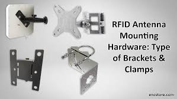

        
2. ### **Operating Frequency and Wavelength Calculation**
    
    - **Operating Frequency and Wavelength Calculation**
		The antenna was designed to operate at a resonant frequency of 2 GHz. The corresponding wavelength in free space is:
	     $λ = c / f = 3 x 10⁸ / 2 x 10⁹ = 150 mm$ 
        Since the monopole length is typically λ/4, the expected physical height of the monopole should be around:
	    $L ≈ λ/4 = 37.5 mm$
		    This value was used as a starting point in the design and we tune it to achieve best results.
        
3. ### **Ground Plane Design**
    
    - A circular ground plane was modeled using a $PEC$ cylinder with the following specifications (as seen in the CST dialog box):

		Outer Radius: $190 mm$

		Thickness $(Z-direction)$: $1.6 mm$ $(from Z = –1.8 mm to Z = –0.2 mm)$

		Material: Perfect Electric Conductor $(PEC)$

		Orientation: Along the Z-axis

		This large ground plane size was chosen to approximate an infinite ground and ensure a proper reflection plane for the monopole radiation.
        
    - 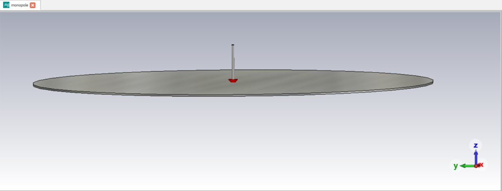
    - 
        
4. ### **Monopole Geometry**
    
    - **Monopole Geometry**
		The monopole was also modeled as a $PEC$ cylinder with the following parameters:

		**Height $(Zmax)$:** L (to be optimized around $37.5 mm$)

		**Radius:** R (typically small, e.g., $1–2 mm$)

		Position: Centered at $(X = 0, Y = 0)$ and extending from $Z = 0 to Z = L$

		Material: $PEC$

		Orientation: $Z-axis$

		These values were fine-tuned through simulation to ensure the antenna resonates precisely at $2 GHz$
        
    - 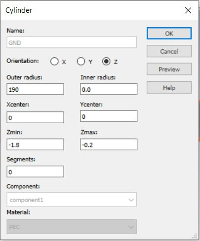 
    - 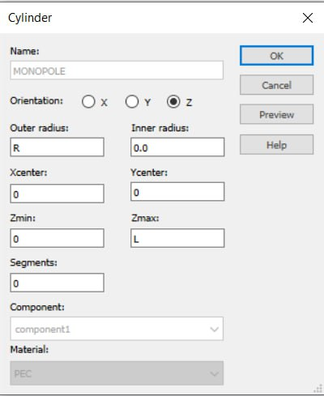
        

5. ### **Feeding Mechanism**
    
    - The antenna was excited using a Discrete Edge Port, which is a simplified feeding method suitable for simulating the excitation between two metal parts without modeling a full coaxial feed structure.
		
        
    - Port Type: S-Parameter:
      Impedance: 36.5 Ohms (This value can be chosen based on the input impedance expected at resonance, or based on matching considerations from literature or tuning.)
    
	- Location:

		Start Point $(X1, Y1, Z1): (0, 0, 0)$ :  **Base of the monopole**

		End Point $(X2, Y2, Z2): (0, 0, –0.2)$ :  **Top surface of the ground plane**
		
	- This setup allows current to flow directly from the monopole into the ground plane, effectively mimicking the function of a feed point without needing to simulate a detailed connector structure. The edge port helps monitor the voltage, current, and S-parameters of the antenna efficiently.

        
    - 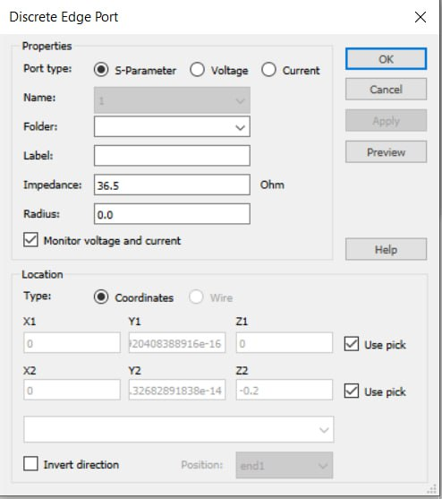

6. ### **Simulation Settings**
    
        
    - **Frequency range:** $1 GHz to 3 GHz$

		**Boundary conditions:** Open (add space)
		
		**Mesh settings:** Adaptive meshing enabled for accuracy
		
		**Solver:** Time-domain solver
		
		**Output parameters:** $S11$, $VSWR$, radiation pattern, and gain
        
    
---

# 3. Simulation Setup and Results

###  Simulation Results

- **S-Parameters**: Minimum S11 value: -$25.07 dB$ at $1.992 GHz$ . This is an excellent return loss, indicating that very little power is being reflected back. Most of the power is being delivered to the antenna.
	

	**Resonant Frequency:** The antenna resonates at approximately $1.992 GHz.$
	
	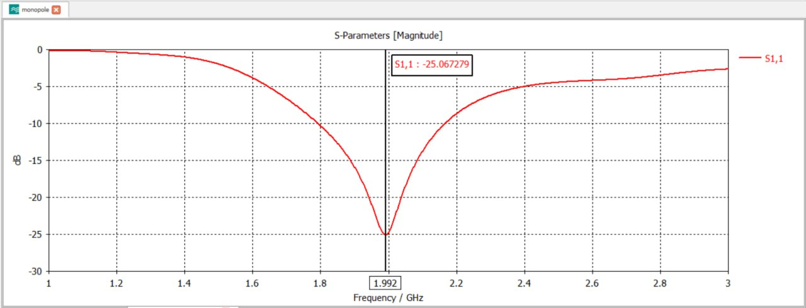
	
	
- **−$10 dB S₁₁$ Bandwidth** :  The antenna’s return‑loss curve crosses −$10 dB$ at about $1.796 GHz$ and $2.171 GHz$, giving a usable bandwidth of ≈ $375 MHz$ (fractional $BW$ ≈ $18.7$%).
  
	 **Center Frequency:**  The midpoint of that band is ≈ $1.992 GHz$, nearly coincident with the design frequency of $2 GHz$
 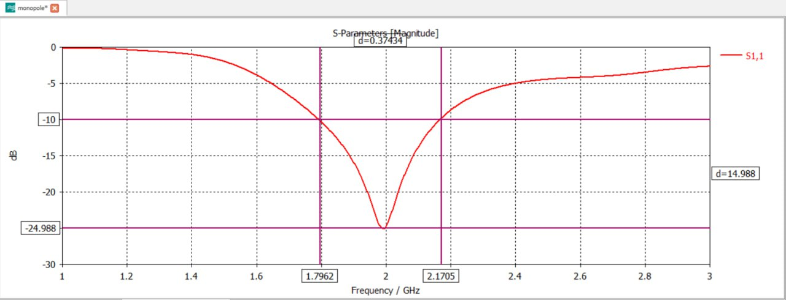
 
    
- **Minimum $VSWR$:** The observed $VSWR$ is $1.12$, indicating an excellent impedance match. This corresponds to a return loss of about –$25 dB$, implying minimal reflection and high power transfer
  
  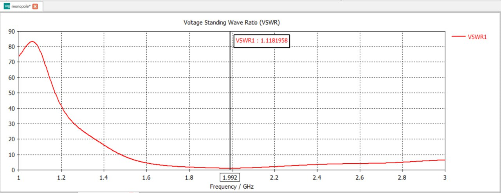
    
- **3D Directivity Pattern**
	The $3D$ radiation pattern exhibits the typical hemispherical profile of a monopole antenna, with maximum radiation occurring in the plane perpendicular to the monopole (horizontal plane).
	
	**Peak Directivity**: Approximately 3 , consistent with theoretical expectations for a quarter-wave monopole above a ground plane

	

- $2D$ Radiation Cuts
	$E_Plane$ $(ϕ = 90°)$:
	Main lobe direction: Peak at $θ ≈ 50°$
	$3 dB$ Beamwidth: Approximately $41°$
	Side-lobe level: Around –$7 dB$, indicating good directivity with moderate side energy
	
	
- H-Plane $(θ = 90°)$:
	Exhibits a nearly omnidirectional pattern with minor ripple variations
	$3 dB$ $Beamwidth$: Approximately $360°$
	
	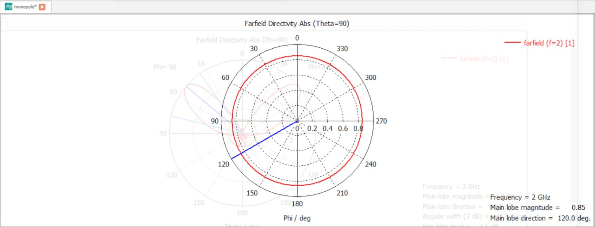
- Peak Gain: The $3D$ gain plot shows a maximum of $2.98(4.74 dbi)$ at $2 GHz$, essentially matching the directivity $2.992 (4.765 dbi)$ since losses are minimal.
	**Gain Pattern:** The radiation shape remains hemispherical, so this peak occurs broadside to the monopole.
	
	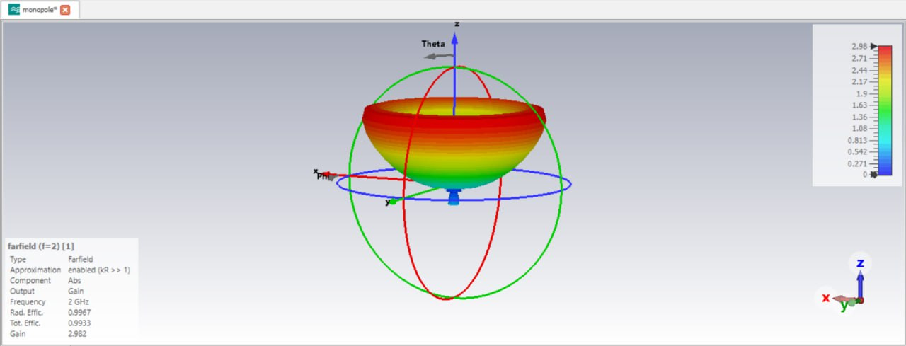
- Radiation Efficiency: Nearly $99.6$% at $2 GH$ $(−0.015 dB)$, tapering to about −$1.23 dB$ ($≈75$%) at $1 GHz$. This confirms conductor and dielectric losses are negligible at resonance
  
  
- **Total Efficiency**: Combining mismatch and radiation losses, total efficiency is –$0.03 dB$ (≈$99$%) at$2 GHz$; it drops to about –$14 dB$ ($≈4$%) at $1 GHz$ when mismatch dominates.
  
  
  
  
# 4. Analysis and Discussion

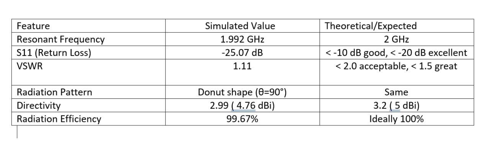

# 5. Conclusion

### **In this project**
a quarter-wavelength monopole antenna was designed, modeled, and simulated at a resonance frequency of $2 GHz$ using CST Studio Suite. The simulation results demonstrate that the antenna achieves excellent performance:
The resonant frequency is accurately centered at $1.992 GHz$, very close to the target $2 GHz$.
The return loss ($S11$) reaches -$25.07 dB$ at resonance, indicating excellent impedance matching and minimal power reflection.
The $VSWR$ of $~1.11$ confirms highly efficient power transfer.
The radiation pattern exhibits the expected toroidal shape, with omnidirectional behavior in the azimuthal plane.
The directivity ($~2.99$ or ~$4.77 dBi$) and radiation efficiency ($>99$%) are in excellent agreement with theoretical values.
Overall, the design is successful and meets the theoretical expectations for a monopole antenna operating at $2 GHz$.

### **Identified Issues:**
Minor deviation of $~0.4$% from the exact $2 GHz$ target frequency. This is negligible for most practical applications but could be improved with finer tuning.
The input impedance of $36.5$ Ohms, while close to typical values, may require matching networks in real-world fabrication to optimize for $50$ Ohm systems.
Future Work Recommendations:
Perform parametric studies to analyze how variations in monopole height and ground plane size affect performance.
Explore real-world fabrication and measurement to compare simulation with practical results.
Consider bandwidth enhancement techniques, such as slotting or using tapered monopole shapes, for broader frequency coverage.
    

---

